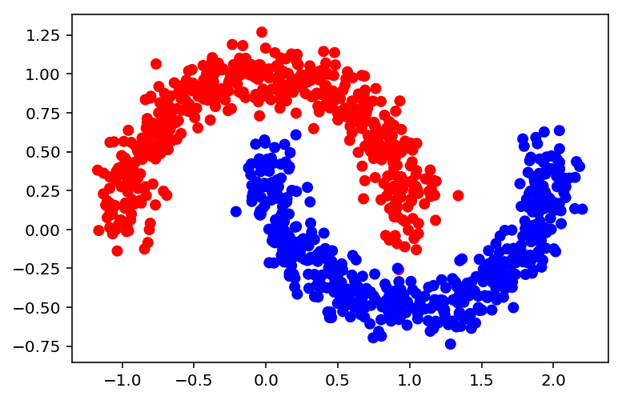
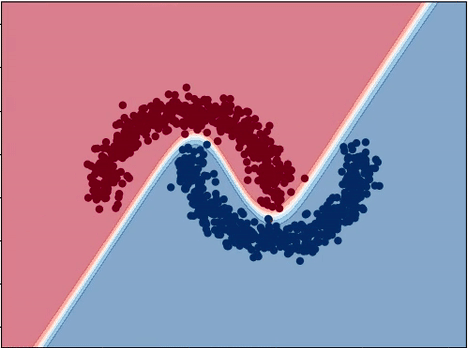

# Visualizing Neural Network's Decision Boundary

## Objective

Here, I will implement an example neural network using Keras and show you how the Neural Network learns over time.

## Tutorial 

I have made an elaborate blog post explaining the code, which you can find [here](https://rohitmidha23.github.io/Neural-Network-Decision-Boundary/).

## Required Python Libraries 

* Keras 
* Sklearn 
* Numpy 
* Matplotlib
* Os

## Dataset 

## Result 

